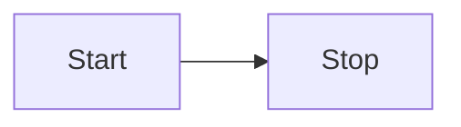

## 🚀 Project Structure

Inside of this Astro + Starlight project, you'll see the following folders and files:

```
.
├── public/
├── src/
│   ├── assets/
│   ├── content/
│   │   ├── docs/
│   │   └── config.ts
│   └── env.d.ts
├── astro.config.mjs
├── package.json
└── tsconfig.json
```

Starlight looks for `.md` or `.mdx` files in the `src/content/docs/` directory. Each file is exposed as a route based on its file name.

Images can be added to `src/assets/` and embedded in Markdown with a relative link.

Static assets, like favicons, can be placed in the `public/` directory.

## 🧞 Commands

All commands are run from the root of the project, from a terminal:

| Command                   | Action                                           |
| :------------------------ | :----------------------------------------------- |
| `npm install`             | Installs dependencies                            |
| `npm run dev`             | Starts local dev server at `localhost:4321`      |
| `npm run build`           | Build your production site to `./dist/`          |
| `npm run preview`         | Preview your build locally, before deploying     |
| `npm run astro ...`       | Run CLI commands like `astro add`, `astro check` |
| `npm run astro -- --help` | Get help using the Astro CLI                     |

## Styles

The styles are in the `src/styles/custom` directory and are overwritten. The Nutshell styles can also be overwritten in this directory.

## Internal Markdown Links for Astro/Starlight:

For this e.g. file structure:
.
├── src/
│ └── content/
│ └── docs/
│ ├── course-info/
│ │ └── titles.md
│ ├── writing/
│ │ └── formatting.md
│ └── gen-ai-policy.md
│ └── index.md
└── public/
├── downloads/
│ └── formattedpaper.docx
└── images/
└── headshot.jpg

## These will work for all pages as absolute links

- page link: Although we present a sample policy [here](/course-ntw2029/course-info/gen-ai-policy)
- heading link: Although we present a sample policy [here](/course-ntw2029/course-info/gen-ai-policy/#nus-general-genai-policy)
- image link (from public folder): 
- link to file for download (from public folder): [Another File](/downloads/formattedpaper.docx)
- Nutshell link to whole page (only works after build):[:This example](/course-ntw2029/course-info/gen-ai-policy) links to `/course-ntw2029/course-info/gen-ai-policy`
- Nutshell heading link: [:LIKE THIS](/course-ntw2029/course-info/gen-ai-policy/#nus-general-genai-policy)!
- Nutshell image link:(from public folder need to add the image to a heading) [:here](/#see-this-is-hidden-image)
- Nutshell link to file for download (Can't be done I think, you can put the link in the heading like below.)
- Nutshell image link:(from public folder need to add the download link to a heading below) [:here](/#see-this-is-hidden-download)

### :x See This Is Hidden Image

Hello


### :x See This Is Hidden download

Hello
[Download File](/downloads/formattedpaper.docx)

## Using the Mermaid Component
How to use the `Mermaid` component within an Astro project to render Mermaid diagrams. This can only be used in *mdx* files

**Importing the Component:**

To use the `Mermaid` component, you must first import it into your MDX page. Below the front matter (second ---) in the body

````mdx
---
import Mermaid from "../../components/Mermaid.astro";

<Mermaid title="Does it work?">



</Mermaid>
````

## To Test the links;

`npm run build` to build the site into the `dist` folder
`npm run preview` to preview the site locally
Be aware that live changes wont effect the site running on preview until you rebuild again.

## How to Use the Nutshell Check Script

This document outlines how to use the `checkNutshellLinks.js` script for verifying internal links within your documentation.

**1. Running the Script on All Files in a Folder:**

- **Purpose:** To check all `.md` files within a specified directory for broken or incorrect internal links.
- **Steps:**

  1.  **Replace Placeholder:** Modify the `YOUR_PATH_TO_FOLDER_HERE` in the following command with the actual path to your `NTW2029\src\content/docs` directory.
  2.  **Execute Command:** Open your terminal or command prompt and run the following command:

      ```bash
      node checkNutshellLinks.js {YOUR_PATH_TO_FOLDER_HERE}\NTW2029\src\content\docs
      ```

      **Example:** If your `NTW2029` folder is located at `C:\Projects`, the command would be:

      ```bash
      node checkNutshellLinks.js C:\Projects\NTW2029\src\content\docs
      ```

**2. Setting Up File Checking in VS Code (For a New Repository):**

- **Purpose:** To create a VS Code task that allows you to quickly check the links in the currently active `.md` file.
- **Steps:**

  1.  **Open User Tasks:**
      - Press `Ctrl+Shift+P` (or `Cmd+Shift+P` on macOS) to open the command palette.
      - Type `>Task` and select "Tasks: Open User Tasks".
  2.  **Paste and Uncomment:**

      - A `tasks.json` file will open.
      - Paste the following JSON code into the `tasks.json` file, replacing any existing content within the `tasks` array.
      - Ensure that the first Line of the JSON is present `{ "version": "2.0.0",`
      - Uncomment the code if needed.

      ```json
      {
        "version": "2.0.0",
        "tasks": [
          {
            "label": "Check Nutshell Links in active file",
            "type": "shell",
            "command": "node",
            "args": ["${workspaceFolder}/checkNutshellLinks.js", "${file}"],
            "options": {
              "cwd": "${workspaceFolder}"
            },
            "problemMatcher": [],
            "group": {
              "kind": "build",
              "isDefault": true
            }
          }
        ]
      }
      ```

  3.  **Save:** Save the `tasks.json` file.
  4.  **Run Task: (If you completed the steps above)**
      - Open the `.md` file you want to check in VS Code.
      - Press `Ctrl+Shift+B` (or `Cmd+Shift+B` on macOS) to run the default build task.
      - The `checkNutshellLinks.js` script will execute, and any errors or warnings will be displayed in the terminal.

## Downloading Course Analytics Events from Vercel/Neon

1.  **Login to Vercel:**

    - Open your web browser and navigate to the Vercel website (vercel.com).
    - Log in using your Vercel account credentials.

2.  **Navigate to your Project:**

    - Locate and select the "JF GenAI Project Pro" from your list of projects.

3.  **Access Storage:**

    - In the project dashboard, find and click on the "Storage" tab.

4.  **Open Neon Database:**

    - Locate the "analytics" storage entry.
    - Click the "Open in Neon" button to access your Neon Postgres database.

5.  **Access Tables:**

    - Once inside the Neon console, locate and click the "Tables" section.

6.  **Clear Filters:**

    - Make sure to clear any existing filters that might be applied to the table. This is to guarantee that you download all available records.

7.  **Adjust Limit:**

    - In the top-right corner of the table view, you'll find a "Limit" setting.
    - By default, it might display a smaller number (e.g., 50).
    - Change the limit to "500" (the maximum allowed) to ensure you retrieve the most records.

8.  **Download as CSV:**
    - Locate the three vertical dots (ellipsis) menu, often found near the table's name or a download option.
    - Click the three dots and select the "Download all as CSV" option.
    - Your browser will download the chat logs as a CSV file to your computer.
