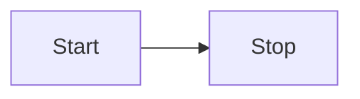
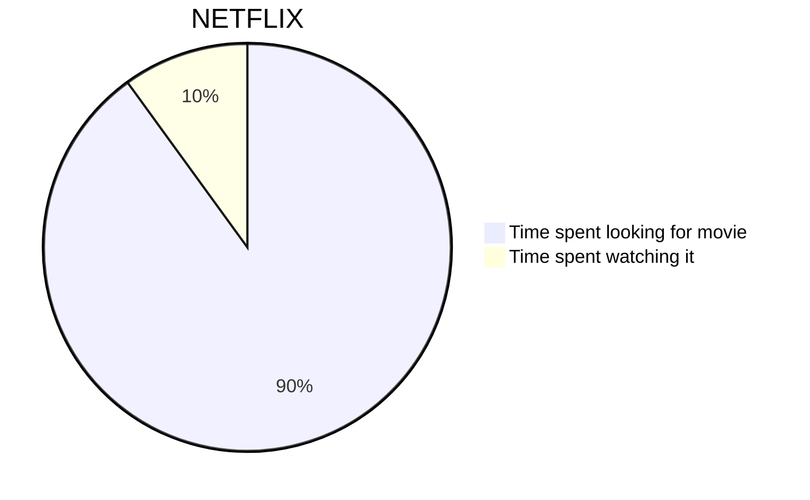

---

title: Welcome to Evolutionary Psychology and Art!
date: 2024-09-09

---

import Mermaid from "../../components/Mermaid.astro";

<Mermaid title="Very Simple">

</Mermaid>

<Mermaid title="Simple">

</Mermaid>

<Mermaid title="Complex">

</Mermaid>