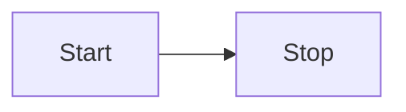
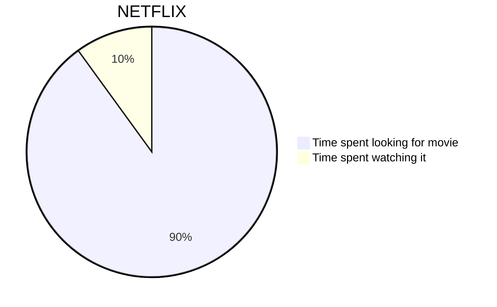
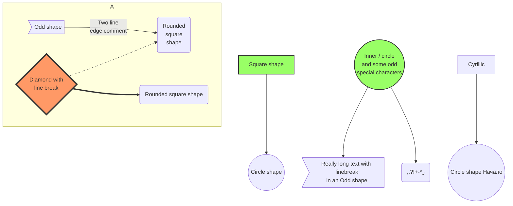

---

title: Welcome to Evolutionary Psychology and Art!
date: 2024-09-09

---

import Mermaid from "../../components/Mermaid.astro";
import Nutshell from "../../components/Nutshell.astro";
import Anchor from "../../components/Anchor.astro";

:::tip
Links that start with `:` are text-expansion links. I recommend reading through the page without clicking, and then going back to click for more detail.
:::

## 1.1 Mon 11 Aug 2025
<Anchor text="## 1.1 Mon 11 Aug 2025"/>

- EP and art topic: origins of evolutionary thought
	- Read before class: none
- Writing topic: university academic writing
- EP and art topic: natural selection, sexual selection, and the gene's eye view
	- Read: watch <Nutshell title="assigned videos"></Nutshell >

- Writing topic: academic writing as a conversation
	- Read before class (recommended):
		- TSIS refers to: Graff, Gerald, and Cathy Birkenstein. _"They Say / I Say": The Moves That Matter in Academic Writing_. 3rd ed. New York: W. W. Norton & Company, 2014.
		- TSIS Preface "Demystifying Academic Conversation", xvi-xxvi
		- TSIS Introduction "Entering the Conversation", 1-15
		- TSIS 14 "What's Motivating this Writer? Reading for the Conversation", 174-183
- Class reading: read all webpages on this website under _Course information_

###### Due Sun 17 Aug 2025: Exercise 2 - explain something

## 2.1 Mon 18 Aug 2025

- EP and art topic: niche construction theory & intro to Evolutionary Psychology (EP)
	- Read: Badcock, Christopher. _Evolutionary Psychology: A Critical Introduction_. Cambridge, England: Polity, 2000. 11-13 [download](/downloads/badcockEEA-11-13.pdf)
- Writing topic: critical thinking
	- Read before class (recommended):
		- TSIS 1 "They Say Starting with What Others Are Saying", 19-29
		- TSIS 2, "Her Point Is The Art of Summarizing", 30-41
		- COR refers to: Booth, Wayne C., Gregory G. Colomb, Joseph M. Williams, Joseph Bizup, and William T. FitzGerald. The Craft of Research. 4th ed. Chicago, IL: University of Chicago Press, 2016.
		- COR 6, "Engaging Sources", (6.1-6.5 only, 85-94)

##### :x assigned videos

- [What is Evolution?](https://youtu.be/GhHOjC4oxh8) (9 min)
- [Survival Of The Fittest — What does it REALLY mean?](https://youtu.be/nUSTpO7-igw) (8 min)
- [How Evolution works](https://www.youtube.com/watch?v=hOfRN0KihOU) (12 min)
- [What is the Evidence for Evolution?](https://youtu.be/lIEoO5KdPvg) (12 min)
- [Does the Theory of Evolution Really Matter?](https://youtu.be/hqepQGOYKZ0) (10 min)
- [What is Natural Selection?](https://youtu.be/0SCjhI86grU) (10 min)
- [Natural Selection & Sexual Selection: An Illustrated Introduction](https://www.youtube.com/watch?v=RxHdzw7E0wU) (9 min)
- [Are Genes Really Selfish? - Instant Egghead #57](https://www.youtube.com/watch?v=8ZlOjVtnRx4) (3 min)
- [What Is The Gene's Eye View of Evolution?](https://youtu.be/KqdlBOoZsXo) (13 min)

{/* <Mermaid title="Very Simple">

</Mermaid>

<Mermaid title="Simple">

</Mermaid>

<Mermaid title="Complex">

</Mermaid> */}