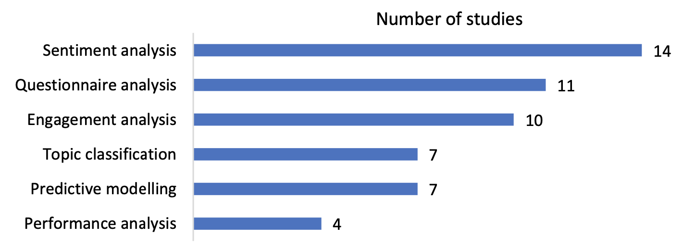
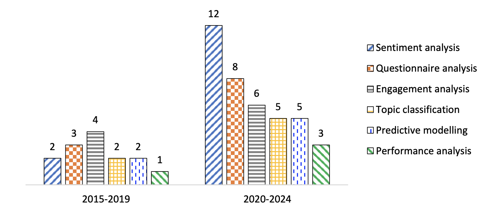

# Paper 1 : The Role of Learning Analytics in Evaluating Course Effectiveness

# Pre-Requisite from past research
- Definition of Course Evaluation : systematic assessment of a course's effectiveness in achieving its educational objectives
- Proposed framework for course evaluation :
  1) Why evaluate (goals)
  2) What is evaluated (process and outcomes)
  3) Who evaluates (students, peers, and self)
  4) When to evaluate (during the course, end of the course, sometime in the future)
 
- In higher education settings, they typically involve collecting data from course evaluation questionnaires to investigate students' perspectives
- Students focus on evaluating the performance/effectiveness of the instructors, targeting clarity of explanation, enthusiasm, availability, and responsiveness to students' needs.

- In contrast, there are the student satifaction surveys (?), which assesses students' perceptions / feelings about their educational experience

- However, positive learning environment, and high ratings of teaching does not always correlate with high ratings for the course itself.

- Due to the advancements of information technology, online evaluation started to be a trend, where learning analytics became a tool to analyze the vast amounts of data.

- However, "there has been a lack of comprehensive review studies focused on this emerging area" (pg. 3)
- Hence, this research focuses on a comprehensive review of the usage of learning analytics and its applications such as identifying the patterns of evaluation practices, data collection methods, analysis techniques, and the evaluated aspects.

- Basically, talks about what learning analytics is consisted of, and how it may help out with enhancing the course evaluation process.

# Methodologies (I am assuming this part is not too significant for our understanding)
- Follows PRISMA (Preferred Reporting Items for Systematic Review and Meta-Analyses).
- The author used a platform called Scopus, a database used for conducting literature reviews across disciplines. The authors focused on keywords such as "Learning Analytics" OR "Machine Learning" OR "Educational Data Mining". 
- The authors filtered the database search so that papers that are relevant to "course evaluation" were chosen.
- The number of studies regarding relevant studies increased from 2019 to 2024, showing the increment of recognition of learning analytics reasearch.

There were six categories of learning analytics applications for course evaluation : 
1) The types, sources, and size fo data used for learning analytics
2) The aspects of courses being evaluated
3) The analysis techniques applied
4) The limitations addressed in the studies

# Applications of Learning Analytics for Course Evaluation

These pictures represent the distribution of studies in each application category for learning analytics and how the trend in the application of learning analytics changes across periods. 

According to the data shown, Sentiment Analysis was the most frequently used application for learning analytics.

## Application 1) Sentiment Analysis
- Known as the method of "opinion mining", it uses "natural language to identify and classify the emotional attitudes expressed within a text". (page 6)

- So, it basically uses the data gained from the feedbacks and analyze the students' emotional response depending on what they wrote for the course evaluation.

- Wide range of analysis methods and tools has been used for sentiment analysis. The most frequently used techniques were machine learning algorithms such as CNN, LSTM, MSPSO (multi-swarm optimization method), and used models such as BERT, BERT-BiLSTM attention model.

- Hence, machine learning algorithms, cloud based tools were used for sentiment analysis.

 
## Application 2) Predictive Modelling (basically machine learning)

- This method reflects the increasing significance of data-driven decision making in educational settings.
- This approach mainly utilizes statistical techniques and machine learning algorithms to not only analyze, but also to predict educational outcomes, which would let educators refine teaching strategies.

- For this method, a lot of statistical algorithms were represented. The main ones were regression analysis, supervised/unsupervised learning algorithms and deep learning algorithms.

<h3>Data types</h3>

  <ul>
    <li>Quantitative Data : Student log data, Course Assessment Scores, and Demographic Information : these data were      obtained in student infromation systems, learning management systems, and student questionnaires</li>
    <li>Qualitative Data : Textual Comments, Open-ended Feedback gathered from MOOC platforms, learning websites, and       Twitter datasets for sentiments.</li>
  </ul>

 
## Application 3) Questionnaire Analysis
- This method involves the systematic evaluation of data collected through questionnaires distributed to students, educators, or stakeholders in an educational context.

